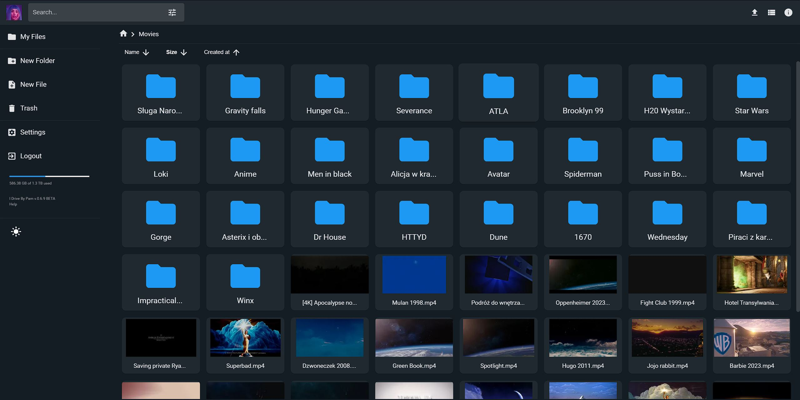
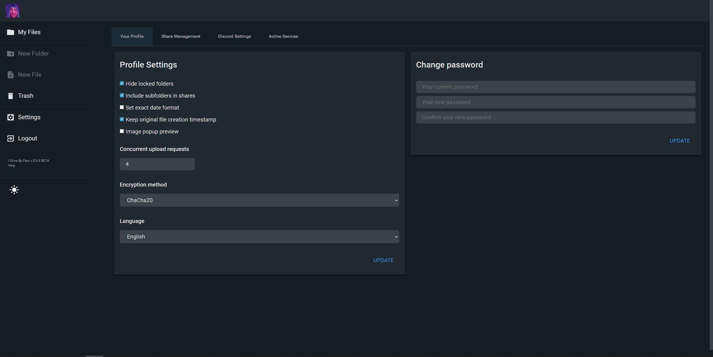
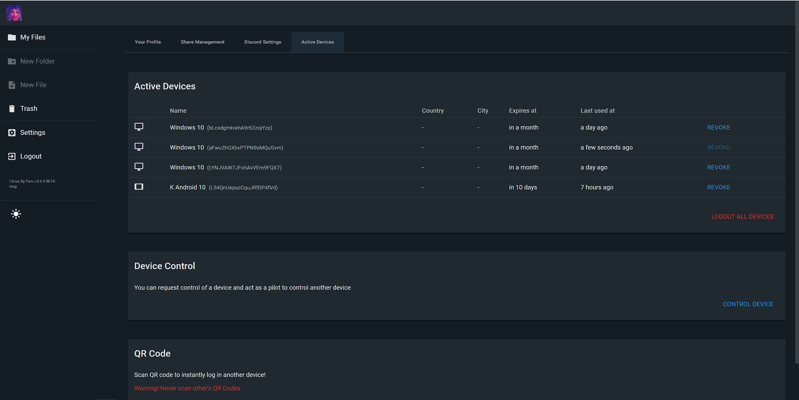

# I Drive

**I Drive** is a cloud storage system & online file browser that stores files on Discord.

It's basically like Google Drive, but instead it stores all files in Discord.


[//]: # ()

[//]: # ()

[//]: # ()

[//]: # ()


# Demo
~~It's vailable at `https://idrive.pamparampam.dev`~~

~~Credentials: `demo`/`demo`~~

Sorry, do demo currently.

# Features

| Feature                                                              | Support |
|----------------------------------------------------------------------|---------|
| Login & Permission system                                            | ✅       |
| Full File encryption                                                 | ✅       |
| Online streaming and viewing of files without downloading            | ✅       |
| Locked folders                                                       | ✅       |
| Bulk zip download                                                    | ✅       |
| Mobile support                                                       | ✅       |
| Share files & folders                                                | ✅       |
| Delete/move/rename files & folders                                   | ✅       |
| Search                                                               | ✅       |
| Supports Polish & English languages                                  | ✅       |
| Code editor with highlighting                                        | ✅       |
| Docker support                                                       | ✅       |
| Dark theme                                                           | ✅       |
| Virtual lists to render tens of thousand of files in a single folder | ✅       |
| And a LOT more features!                                             | ✅       |

For a list of bugs, and planned features
[Click here](https://github.com/pam-param-pam/I-Drive/blob/master/TODO.md)
# How it works

In essence, **I Drive** simply takes your upload files, and splits them into chunks to fit in Discord's (10Mb) file size limit. 
They are then encrypted and uploaded to Discord. After the upload is done, file's metadata is sent to backend and stored into a central database.
This allows for a simple way of viewing, managing, and downloading of your files.


# Technical Details
In reality the Frontend does a LOT more than just splitting the file into chunks.
It has to:
- Calculate crc checksum 
- Generate metadata
- Generate thumbnails
- Extract subtitles
- Encrypt the file and more
- And more!

The same thing applies to pretty much every part of this app. Even if something looks simple at first glance. 
It's most likely pretty complicated under the hood. 
After all, this entire project has more than **33k** lines of code. 
And another **2k** of configuration and translation lines


## Infrastructure

**I Drive** is made up of 5 main components.

### Frontend

Frontend is made with _vue3_ + _vite_. 
Vue Router is used for routing and Pinia as global state management. 
It's then built and served statically by NGINX                 

Why vue? Its data-driven approach makes it ideal for application which DOM is based on the underlying data.

### Backend

Main backend is made with 🐍 Python, Django, Daphne, Channels, Rest Framework 🐍
It's responsible for authenticating users and communicating with a database. 
It uses REST API to both serve & modify data.
The main backend has more than 80 different endpoints.

Backend uses websockets to communicate data changes to the clients. 
A list of all websocket events can be found in [here](https://github.com/pam-param-pam/I-Drive/blob/9700a6fb1ef982ae10a2f976f75e9ee8b74ee37e/backend/website/constants.py#L102-L119)

It's also responsible for streaming files from Discord. 
It supports partial requests, streaming, in browser video/audio seeking, decryption.

Thanks to a [custom zipFly](https://github.com/pam-param-pam/ZipFly) library it also supports streaming zip files "on the fly"


### Database
Postgres is currently used as a database

### Redis
Redis is used as a fast in memory database for caching and message broker for celery.
It also serves as a channel layer for django websockets

### Celery
Asynchronous task queue for delegating long tasks like file deletion outside of HTTP call lifecycle.

## Solving Discord's rate limit problems
    
On average Discord allows a single bot to make 1 request a second, that's way to little! 
That's why, for **iDrive** to work, a single user needs at least few bots, 
this way backend can switch between tokens and bypass Discord's ratelimits. 
The same thing applies to Discord channels and webhooks. 
Sadly discord still groups all requests per ip as well, so the ratelimits are still sometimes hit.

Discord issues cloudflare bans if you make more than 10k 4xx requests in 10 minutes. 
**iDrive** tries to avoid this as much as possible, including throwing 502 errors when it can't handle more requests


## Why use both webhooks and Discord bots? 
Why are webhooks needed? Why not use Discord bots to upload files?

Discord bots are in my opinion too powerful to send tokens back and forth in the browser. 
In an unlikely situation, a third party could steal bot's token and access all 
files stored(encrypted or not) on a Discord server. 
Discord bots if given too many permissions would also allow for easy raiding and greefing.

Webhooks on the other hand can only send messages, and delete/modify their own.

## Why is this/that so slow!
It's written is python, what do you expect. Rewrite it in rust!


## Docker support
I drive is fully dockerized! Yay. There are 4 containers managed by `docker compose`: 

* Backend, containing a backend server and celery
* Nginx, it's responsible for reverse proxy, cache, and serving the static frontend files.
* Redis
* Postgres


# Deployment

1) Create a fresh directory and in it
2) create `docker-compose.yml` file. Copy content from [here ](https://raw.githubusercontent.com/pam-param-pam/I-Drive/refs/heads/master/docker-compose.yml) to it.

3) create `nginx.conf` file. Copy content from [here ](https://raw.githubusercontent.com/pam-param-pam/I-Drive/refs/heads/master/nginx.conf) to it.
4) create `.env` file and copy these values:
```
IS_DEV_ENV=True
PROTOCOL=http
DEPLOYMENT_HOST=localhost
NGINX_PORT=80

BACKEND_SECRET_KEY=very_secret_key
BACKEND_BASE_URL=http://localhost

REDIS_PASSWORD=1234

POSTGRES_USER=admin
POSTGRES_PASSWORD=1234

BACKEND_PORT=8001
```

5) Run `docker-compose up`
6) Run `docker exec -it idrive-backend bash`
7) Run `python manage.py migrate website` to setup a database
8) Run `python manage.py createsuperuser` to create admin user
9) Go to browser and type `localhost`


# Building from source

**You need python version 3.11 installed. 
Tested on Node v20.10.0**


1) Clone this repository
* `git clone https://github.com/pam-param-pam/I-Drive`

2) Start redis.
* `docker run -d --name dev_idrive_redis -p 6379:6379 redis:latest redis-server --requirepass 1234`

3) Start postgres
* `docker run -d --name dev_idrive_postgres -e POSTGRES_DB=dev_idrive_postgres -e POSTGRES_USER=admin -e POSTGRES_PASSWORD=1234 -p 5432:5432 -v dev_idrive_postgres_data:/var/lib/postgresql/data postgres:16`

4) Navigate to the cloned repo. Find `frontend` dir. In it create `.env` file and put these variables:
````
VITE_BACKEND_BASE_URL=http://localhost:8000
VITE_BACKEND_BASE_WS=ws://localhost:8000
````

5) Inside the `frontend` dir run these commands:
* `npm install` to install all requirements
* `npm run dev -- --host 0.0.0.0 --port 5173` to start the frontend dev server

6) Navigate back to the cloned repo root. Find `backend` dir. In it create `.env` file and put these variables:
```
IS_DEV_ENV=True
PROTOCOL=http
DEPLOYMENT_HOST=localhost
NGINX_PORT=80

BACKEND_SECRET_KEY=very_secret_key
BACKEND_BASE_URL=http://localhost:8000

REDIS_PASSWORD=1234
REDIS_ADDRESS=localhost
REDIS_PORT=6379

POSTGRES_ADDRESS=localhost
POSTGRES_PORT=5432
POSTGRES_NAME=dev_idrive_postgres
POSTGRES_USER=admin
POSTGRES_PASSWORD=1234
```
7) Inside `backend` dir run these commands.

If on windows:
```
# 1. Create virtual environment
py -3.11 -m venv .venv

# 2. Activate the virtual environment
.venv\Scripts\activate 

# 3. Install dependencies
pip install -r requirements.txt

# 4. Run migrations
python manage.py migrate

# 5. Create admin user
python manage.py createsuperuser

# 6. Start backend dev server
python manage.py runserver 0.0.0.0:8000

# 7. start both celeries #todo
```

If on MacOc/Linux

8) Everything should work now, head over to `localhost:5173` to see the website


# PS
Dear Discord, please don't sue me 👉👈

