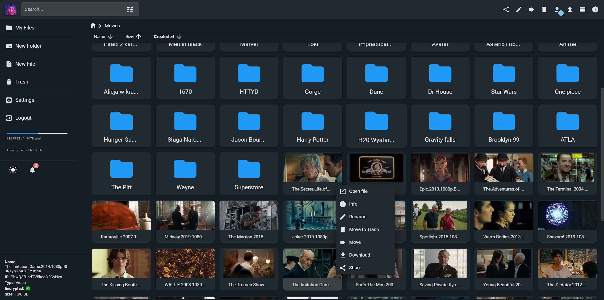
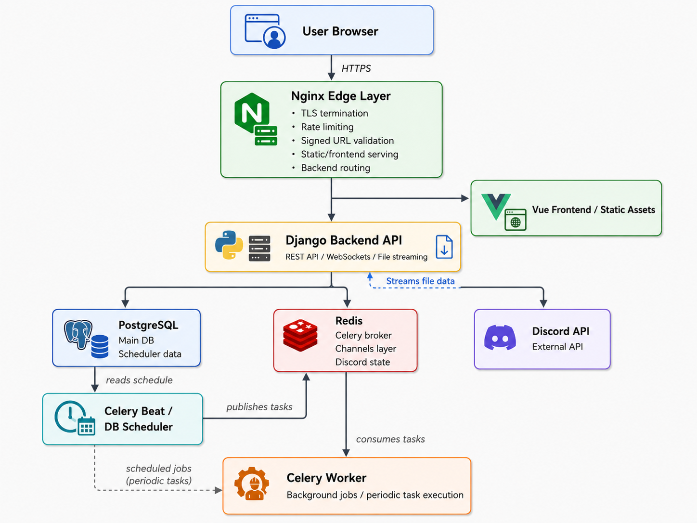

# I Drive

**I Drive** is a cloud storage system & online file browser that stores files on Discord.
It's basically like Google Drive, but it stores all files on Discord instead. 

Want to know how **iDrive** works under the hood? [Read here](https://github.com/pam-param-pam/I-Drive/blob/master/YAP.md)

# Demo
~~It's available at `https://idrive.pamparampam.dev`~~

~~Credentials:~~  ~~`demo`~~/~~`demo`~~

Sorry, no demo currently.

# Features

| Feature                                                              | Support |
|----------------------------------------------------------------------|---------|
| Online streaming and viewing of files without downloading            | ✅       |
| Delete/move/rename files & folders                                   | ✅       |
| Share files & folders                                                | ✅       |
| Full File encryption                                                 | ✅       |
| Advanced search                                                      | ✅       |
| Login & Permission system                                            | ✅       |
| Dark theme                                                           | ✅       |
| Code editor with highlighting                                        | ✅       |
| Mobile support                                                       | ✅       |
| Bulk zip download                                                    | ✅       |
| Supports Polish & English languages                                  | ✅       |
| Docker support                                                       | ✅       |
| Virtual lists to render tens of thousand of files in a single folder | ✅       |
| ZIP file archive viewer                                              | ✅       |
| And a LOT more features!                                             | ✅       |

# Architecture diagram

# Fast deployment

1) Run `curl -fsSL https://raw.githubusercontent.com/pam-param-pam/I-Drive/refs/heads/master/scripts/bootstrap.sh -o bootstrap.sh && chmod +x bootstrap.sh && bash bootstrap.sh`
2) Go to browser and type `localhost`

To see all configurable options, run:
`bash bootstrap.sh --help`
 
 

**How to configure Discord Settings:**

1. Enable Discord **Developer Mode**.  
   See: [How to enable Developer Mode](https://www.youtube.com/watch?v=8FNYLcjBERM)

2. Create a new Discord server and copy its **Guild ID**.  
   See: [How to copy the Guild ID](https://www.youtube.com/watch?v=HjkRZy5d_qM&t=40s)

3. Create a new Discord bot:  
   [Create a new Discord application](https://discord.com/developers/applications?new_application=true)

4. In the Discord Developer Portal, open your bot settings and enable the required intent:

   **Bot → Privileged Gateway Intents → Message Content Intent**

5. Generate an invite URL for the bot:

   **OAuth2 → URL Generator → Scopes → bot**

6. Select the required bot permissions.

   You can either select **Administrator**, or grant the following permissions manually:

   - Manage Channels
   - Manage Roles
   - Manage Webhooks 
   - Manage Messages
   - View Channels
   - Read Message History
   - Send Messages
   - Attach Files

7. Open the bot settings, reset the bot token, and copy the new access token:

   **Bot → Reset Token**

8. Open the generated invite URL and invite the bot to your Discord server.

After completing these steps, you should have:

- the Discord server
- its Guild ID
- the primary bot configured
- the bot token

> [!IMPORTANT] 
> If you want to add another bot in the future, you can skip step 6. The required permissions will be granted to the bot automatically after you invite the bot to the server.

# Building from source

1) Run `curl -fsSL https://raw.githubusercontent.com/pam-param-pam/I-Drive/refs/heads/master/scripts/setup-dev.sh -o setup-dev.sh && chmod +x setup-dev.sh && bash setup-dev.sh`
2) Go to browser and type `localhost:5173`

> [!NOTE] 
> This creates a standard development environment with default configuration. **DO NOT USE IT IN PRODUCTION**.

You can adjust the configuration after setup:

backend: `backend/.env`
frontend: `frontend/.env`

# PS
Dear Discord, please don't sue me 👉👈
