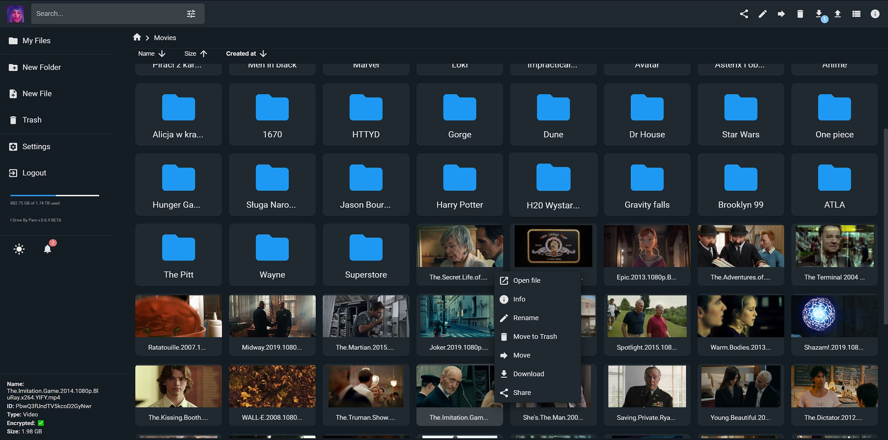
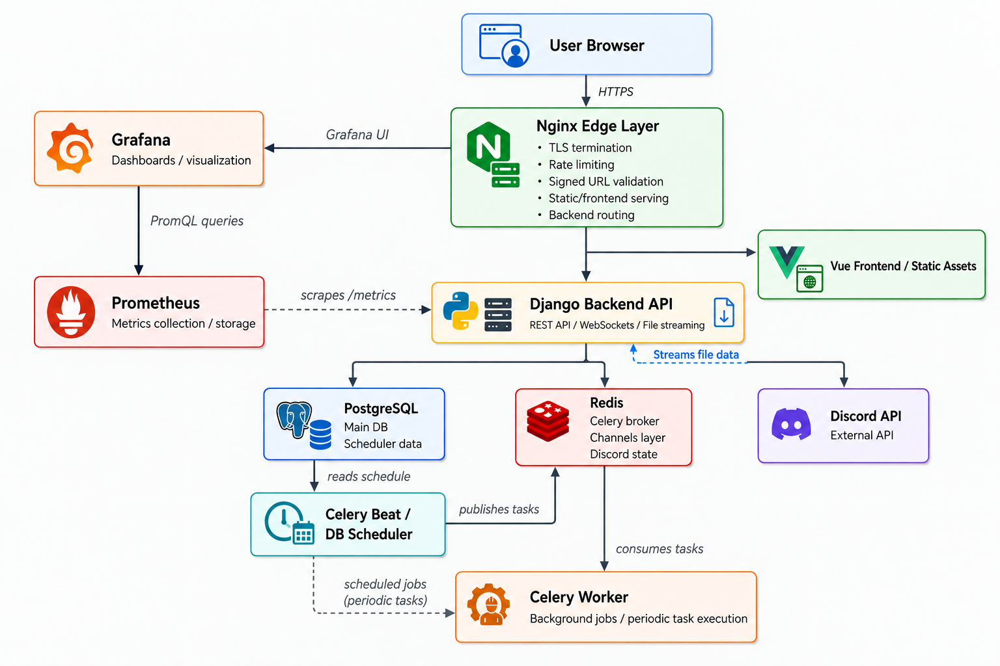

# I Drive

**I Drive** is a cloud storage system & online file browser that stores files on Discord.
It's basically like Google Drive, but it stores all files on Discord instead. 

Want to know how **iDrive** works under the hood? [Read here](https://github.com/pam-param-pam/I-Drive/blob/master/YAP.md)

# Demo
It's available at [https://idrive.pamparampam.dev](https://idrive.pamparampam.dev)

Credentials: `demo`/`demo`

**Please keep in mind that this project is maintained by a single student developer and is currently in an early alpha stage. 
If you encounter any bugs or issues, please report them.**

# Features

| Feature                                                              | Support |
|----------------------------------------------------------------------|---------|
| Online streaming and viewing of files without downloading            | ✅       |
| Delete/move/rename files & folders                                   | ✅       |
| Share files & folders                                                | ✅       |
| Full File encryption                                                 | ✅       |
| Advanced search                                                      | ✅       |
| Login & Permission system                                            | ✅       |
| Dark theme                                                           | ✅       |
| Text/Code editor with highlighting                                   | ✅       |
| Mobile support                                                       | ✅       |
| Bulk zip download                                                    | ✅       |
| Supports Polish & English languages                                  | ✅       |
| Docker support                                                       | ✅       |
| Virtual lists to render tens of thousand of files in a single folder | ✅       |
| ZIP file archive viewer                                              | ✅       |
| Client side decryption                                               | ✅       |
| And a LOT more features!                                             | ✅       |

# Architecture diagram

# Fast deployment

1) Run `curl -fsSL https://raw.githubusercontent.com/pam-param-pam/I-Drive/refs/heads/master/scripts/bootstrap.sh -o bootstrap.sh && chmod +x bootstrap.sh && bash bootstrap.sh`
2) Go to browser and type `localhost`

To see all configurable options, run:
`bash bootstrap.sh --help`
 
 

**How to configure Discord Settings:**

1. Enable Discord **Developer Mode**.  
   See: [How to enable Developer Mode](https://www.youtube.com/watch?v=8FNYLcjBERM)

2. Create a new Discord server and copy its **Guild ID**.  
   See: [How to copy the Guild ID](https://www.youtube.com/watch?v=HjkRZy5d_qM&t=40s)

3. Create a new Discord bot:  
   [Create a new Discord application](https://discord.com/developers/applications?new_application=true)

4. In the Discord Developer Portal, open your bot settings and enable the required intent:

   **Bot → Privileged Gateway Intents → Message Content Intent**

5. Generate an invite URL for the bot:

   **OAuth2 → URL Generator → Scopes → bot**

6. Select the required bot permissions.

   You can either select **Administrator**, or grant the following permissions manually:

   - Manage Channels
   - Manage Roles
   - Manage Webhooks 
   - Manage Messages
   - View Channels
   - Read Message History
   - Send Messages
   - Attach Files

7. Open the bot settings, reset the bot token, and copy the new access token:

   **Bot → Reset Token**

8. Open the generated invite URL and invite the bot to your Discord server.

After completing these steps, you should have:

- the Discord server
- its Guild ID
- the primary bot configured
- the bot token

> [!IMPORTANT] 
> If you want to add another bot in the future, you can skip step 6. The required permissions will be granted to the bot automatically after you invite the bot to the server.

# Local development

The local environment runs PostgreSQL, Redis, Prometheus, and Grafana in Docker. Django, Vite, and the optional Celery processes run natively with hot reload.

> [!NOTE]
> The local configuration uses development credentials and settings. **Do not use it in production.**

## Prerequisites

- Python 3.12
- Node.js and npm
- Docker with Docker Compose
- A JetBrains IDE with Python support, such as PyCharm

## First-time setup

Select `backend/.venv` as the interpreter for the shared run configurations, then run **Setup local environment**. The setup installs the backend and frontend dependencies, starts the local Docker infrastructure, applies migrations, and creates the local administrator.

When setup finishes, configure the project structure in PyCharm:

1. Mark `backend` as **Sources Root**.
2. Mark `backend/staticfiles` as **Excluded**.

## Running the application

Select **Local development** from the run-configuration list and click **Run**. This configuration:

1. Starts PostgreSQL, Redis, Prometheus, and Grafana using `local-testing.docker-compose.yml`.
2. Waits until the infrastructure is ready.
3. Applies pending Django migrations.
4. Creates the Django administrator if it does not exist.
5. Starts Django and Vite with hot reload.

Celery is optional. After **Local development** is running, start the separate **Local Celery** configuration to run the general worker, websocket worker, deletion worker, and Celery Beat.

Stopping a run configuration stops the processes managed by that configuration. Docker volumes are not deleted, so PostgreSQL, Redis, Prometheus, and Grafana data persists between runs.

## Local addresses

| Service    | Address                 |
|------------|-------------------------|
| Frontend   | http://localhost:5173   |
| Backend    | http://localhost:8000   |
| Grafana    | http://localhost:3000   |
| Prometheus | http://localhost:9090   |

The default Django and Grafana login is `admin` / `admin`.

## Configuration

Local defaults are defined by the launcher and `local-testing.docker-compose.yml`. To override them, create or edit `.env` in the repository root. The same file is loaded by the native processes and Docker Compose.

Grafana provisioning and dashboards are mounted from `grafana/`. Prometheus loads its configuration from `prometheus/prometheus.yml`, so local monitoring changes do not require custom development images.

# Performance

I Drive is fast enough for normal web-based file browsing, uploading, downloading, and streaming.

Typical speeds through the web interface:

| Operation                          | Speed    |
|------------------------------------|----------|
| Upload through web interface       | ~20 MB/s |
| Download through web interface     | ~25 MB/s |
| Zip download through web interface | ~25 MB/s |

Download speed in the web interface is mainly constrained by backend bandwidth.
When client-side decryption is not enabled, download speed will also be limited by server CPU, because files must be decrypted on the server before being sent to the client.
Performance is also affected by the number of requests that need to be made to Discord. Smaller files require more individual requests, which can reduce overall throughput.
A lot of requests to discord will also require more bots.

Upload speed in the web interface is limited by thumbnail processing and internal browser bottlenecks.

For maximum speed, use the [iDrive-Toolkit](https://github.com/pam-param-pam/iDrive-api-wrapper).

With the API wrapper, downloads can reach the maximum speed available from your ISP. In testing, downloads reached around **200 MB/s**. Uploads reached around **50 MB/s**, with thumbnail extraction being the main bottleneck.

# PS
Dear Discord, please don't sue me 👉👈
